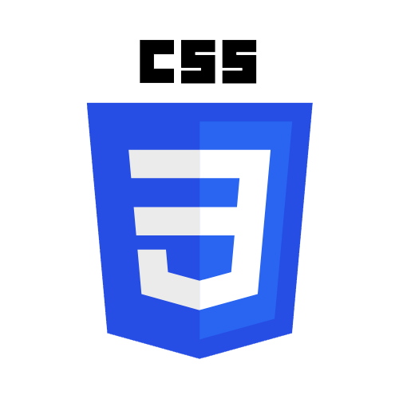

## Hi there, I'm Yunus Emre Yılmaz - [Linkedin] 👋 

### I'm a Student and Developer.

<h4 align="center">I’m a self-taught developer. I’m currently developing an E-commerce site and PWA with angular. I’m a trilingual person (French,English,Turkish). I’m open to all kinds of programming.</h3>

-  I’m currently working on : [ReCapProject] & [ReCapProject-fe]!
-  I’m currently learning C#

### Contact with me:

 

### Languages and Tools:

[][vscode]
[][VisualStudio]
[][Rider]
[][html]
[][htmldark]
[][css]
[][cssdark]
[][javascript]
[][nodejs]
[][angular]
[][typescript]
[][.NetCore]
[][MicrosoftSqlServerDark]
[][MicrosoftSqlServer]
[][git]
[][githubdark]
[][github]
[][bootstrap]

 
 

---

  
:zap: GitHub Stats

 

&nbsp;

[Linkedin]: https://www.linkedin.com/in/yeyilmaz/
[twitter]: https://twitter.com/yeyilmaz99
[MicrosoftSqlServer]: https://www.microsoft.com/tr-tr/sql-server/sql-server-downloads#gh-dark-mode-only
[MicrosoftSqlServerDark]: https://www.microsoft.com/tr-tr/sql-server/sql-server-downloads#gh-light-mode-only
[twitch]: https://twitch.tv/malmenk
[instagram]: https://instagram.com/yeyilmaz.io
[linkedin]: https://linkedin.com/in/yeyilmaz
[vscode]: https://code.visualstudio.com/
[html]: https://www.w3schools.com/html/#gh-dark-mode-only
[htmldark]: https://www.w3schools.com/html/#gh-light-mode-only
[css]: https://www.w3schools.com/css/#gh-dark-mode-only
[cssdark]: https://www.w3schools.com/css/#gh-light-mode-only
[javascript]: https://www.w3schools.com/js/
[nodejs]: https://nodejs.org/en/
[angular]: https://angular.io/
[typescript]: https://www.typescriptlang.org/
[git]: https://git-scm.com/
[github]: https://github.com/yeyilmaz99#gh-dark-mode-only
[githubdark]: https://github.com/yeyilmaz99#gh-light-mode-only
[ReCapProject]: https://github.com/yeyilmaz99/ReCapProject
[ReCapProject-fe]: https://github.com/yeyilmaz99/ReCapProject-fe
[bootstrap]: https://getbootstrap.com/
[photoshop]: https://www.adobe.com/tr/products/photoshop.html
[lightroom]: https://www.adobe.com/tr/products/photoshop-lightroom.html
[CSharp]: https://docs.microsoft.com/tr-tr/dotnet/csharp/
[.NetCore]: https://dotnet.microsoft.com/en-us/download
[VisualStudio]: https://visualstudio.microsoft.com/tr/
[Rider]: https://www.jetbrains.com/rider/

